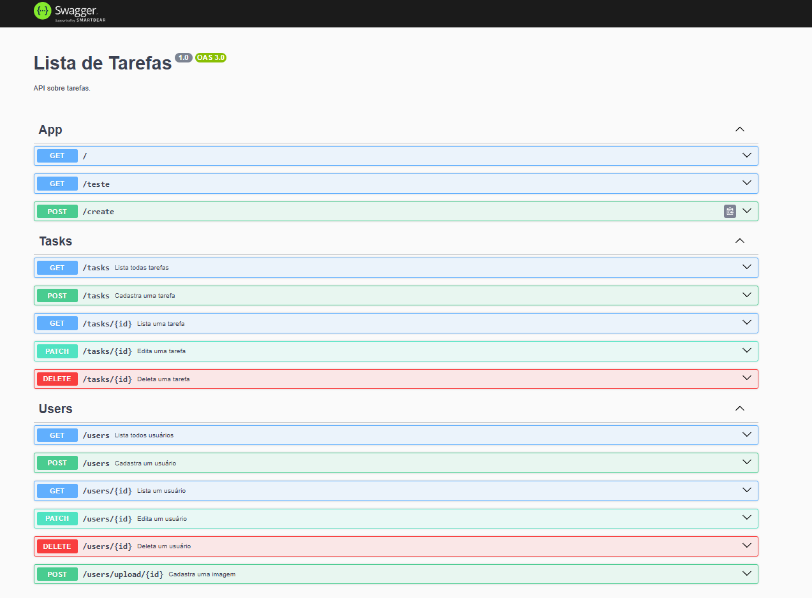

## Documentação da Api

- Link da Documentação da Api: http://localhost:3000/docsApi

## Diferença entre Middlewares, Filter e Guards

**Middleware: Serve para interceptar e manipular requisições/respostas em geral.**

**Filters: Aplicam lógica personalizada antes ou depois de ações específicas.**

**Guards: Controlam o acesso às rotas ou ações com base em condições.**
